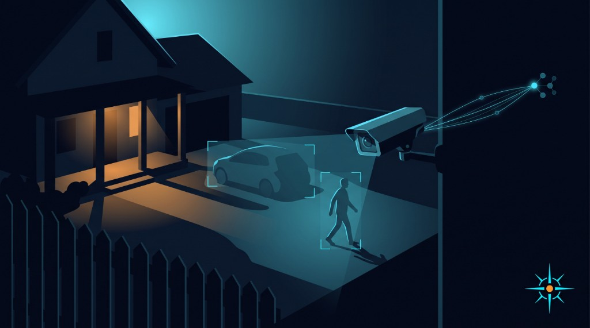

# HACS Comstar Vision

  

  

Home Assistant motion / gate still-burst analysis via [Agentic Orchestration](https://github.com/zlatko-lakisic/agentic-orchestration) **AO Reach** — same framework as [Agentic Watering](https://github.com/zlatko-lakisic/hacs-agentic-watering) and [Comstar](https://github.com/zlatko-lakisic/hacs-comstar), replacing **LLM Vision** for driveway and perimeter notifies.

## Features

- `comstar_vision.image_analyzer` — drop-in for `llmvision.image_analyzer` (`response_text`)
- Reach `SessionBridge` → ADA engine `:8765` (session overlay + mTLS)
- Overlay agent `client.vision_scene_analyzer` (plain-text 3-line replies) — **AO picks the vision model**
- Catalog-driven settings: agents, MCP servers, skills, harness (overlaid onto the selected AO)
- Services: `pair`, `probe_reach`, `clear_pairing`, `refresh_overlay`

## Install

See [docs/INSTALL.md](docs/INSTALL.md).

Quick path: HACS custom repo `https://github.com/zlatko-lakisic/hacs-comstar-vision` → add integration → engine `https://10.0.10.16:8765` → mint Bearer for **`appId: comstar-vision`** → select agents / MCPs / skills / harness from the AO catalog.

## Orchestrator-driven model selection

Comstar Vision does **not** pin an OpenAI (or any) model. Configure capability (agents, MCPs, skills, harness) in the integration options; the overlay is registered on ADA and the orchestrator chooses a vision-capable model for image turns. Optional service field `model` is an escape hatch only (`[model=…]` prefix).

ADA must have at least one vision-capable model configured (local VLM or valid cloud key). Missing vision → `vision_unavailable` (fail-closed).

## AO multimodal

Reach multimodal `images` on `chat` / `direct_agent` landed in AO Reach **0.10.0** and the ADA handoff:

**[docs/AO_REACH_MULTIMODAL_HANDOFF.md](docs/AO_REACH_MULTIMODAL_HANDOFF.md)**

Enable **Multimodal ready** in options after ADA is verified.

## Services

| Service | Purpose |
|---------|---------|
| `comstar_vision.image_analyzer` | Analyze local JPEG stills; returns `response_text` |
| `comstar_vision.pair` | mTLS enroll |
| `comstar_vision.clear_pairing` | Delete local PEMs |
| `comstar_vision.probe_reach` | Session / overlay / pairing status |
| `comstar_vision.refresh_overlay` | Re-register overlay agents |

## Docs

- [Install & pairing](docs/INSTALL.md)
- [AO Reach multimodal handoff](docs/AO_REACH_MULTIMODAL_HANDOFF.md) (ADA engine work)
- [Live cutover checklist](docs/LIVE_CUTOVER.md)

## License

Apache-2.0
