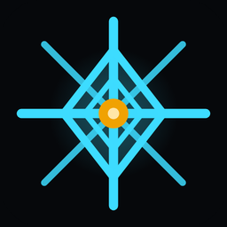

# HACS Comstar Vision

  

Home Assistant motion / gate still-burst analysis via [Agentic Orchestration](https://github.com/zlatko-lakisic/agentic-orchestration) **AO Reach** — same framework as [Agentic Watering](https://github.com/zlatko-lakisic/hacs-agentic-watering) and [Comstar](https://github.com/zlatko-lakisic/hacs-comstar), replacing **LLM Vision** for driveway and perimeter notifies.

## Features

- `comstar_vision.image_analyzer` — drop-in for `llmvision.image_analyzer` (`response_text`)
- Reach `SessionBridge` → ADA engine `:8765` (session overlay + mTLS)
- Overlay agent `client.vision_scene_analyzer` (plain-text 3-line replies)
- Services: `pair`, `probe_reach`, `clear_pairing`, `refresh_overlay`

## Install

See [docs/INSTALL.md](docs/INSTALL.md).

Quick path: HACS custom repo `https://github.com/zlatko-lakisic/hacs-comstar-vision` → add integration → engine `https://10.0.10.16:8765` → mint Bearer for **`appId: comstar-vision`**.

## AO multimodal prerequisite

Reach chat is text-only until the engine accepts an `images` field. Client support is already in this repo; ADA work is described in:

**[docs/AO_REACH_MULTIMODAL_HANDOFF.md](docs/AO_REACH_MULTIMODAL_HANDOFF.md)**

Until that ships, leave **Multimodal ready** off — `image_analyzer` returns a clear error so blueprints fall back safely.

## Services

| Service | Purpose |
|---------|---------|
| `comstar_vision.image_analyzer` | Analyze local JPEG stills; returns `response_text` |
| `comstar_vision.pair` | mTLS enroll |
| `comstar_vision.clear_pairing` | Delete local PEMs |
| `comstar_vision.probe_reach` | Session / overlay / pairing status |
| `comstar_vision.refresh_overlay` | Re-register overlay agents |

## Docs

- [Install & pairing](docs/INSTALL.md)
- [AO Reach multimodal handoff](docs/AO_REACH_MULTIMODAL_HANDOFF.md) (ADA engine work)
- [Live cutover checklist](docs/LIVE_CUTOVER.md)

## License

Apache-2.0
